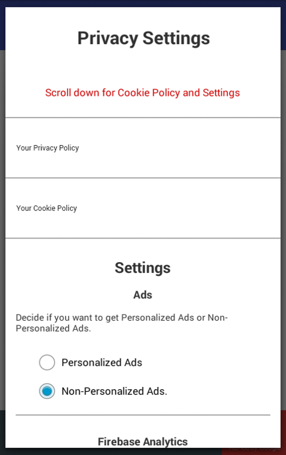
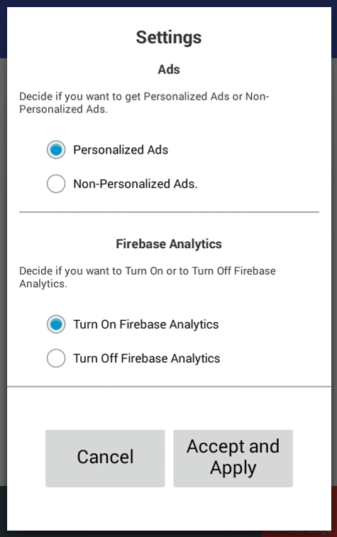

# android-user-consent-dialog

## Introduction
The following Android example app shows you the implementation of an user consent dialog for the EU User Consent Policy. The app uses Google's Firebase and Google mobile ads.  

The consent appears if you run the app for the first time, appears always at start until you agree with the policy, and is also available
by the app menu.  

The dialog contains a privacy policy, cookie policy and the settings for personalized/non-personlized ads respectively turning on/off of
Firebase analytics.

## How it works ...
A short explanation about running the app and how it works.

### Running the app for the first time
If you run the app for the first time, at all, the user consent dialog appears:  

 

See sample app doesn't have any law text. You have to add your own text here.
If you scroll down, you reach the settings section, where the user can set
their prefered settings for personalized/non-personlized ads respectively turning on/off of
Firebase analytics.

         

## Implementation

### Example
You can find an example for the implementation in my app *Cool Down!*  
[https://play.google.com/store/apps/details?id=com.pertpony.cooldown](https://play.google.com/store/apps/details?id=com.pertpony.cooldown)

## Law stuff
### Warranty
NO WARRANTY FOR FULL COMPLYING WITH LAWS, USING ON OWN RISK, I'M NOT A LAWYER

### License

